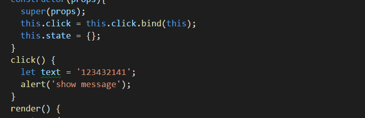

# create-react-app
React framework learning notes 

### 项目文件结构

```
my-app/
  README.md
  img/                                     ---readme图片存放地址
  node_modules/
  package.json
  public/
    index.html
    favicon.ico
  src/
    App.css
    App.js
    App.test.js
    index.css
    index.js
    logo.svg
```

* `public/index.html`为SPA的html模板文件；
* `src/index.js` 是项目的入口文件。

### 如何配置eslint

你需要在package.json中添加以下配置(我比较喜欢这种，其他的就不介绍了)：

```json
{
  // ...
  "eslintConfig": {
    "extends": "react-app"
  }
}
```

添加完成后需要安装一下的依赖包：
```bash
npm install -g eslint-config-react-app@0.3.0 eslint@3.8.1 babel-eslint@7.0.0 eslint-plugin-react@6.4.1 eslint-plugin-import@2.0.1 eslint-plugin-jsx-a11y@2.2.3 eslint-plugin-flowtype@2.21.0
```

与此同时你需要在vscode中添加该插件[vscode-eslint](https://marketplace.visualstudio.com/items?itemName=dbaeumer.vscode-eslint)

以上的工作完成后，在开发过程中则会有一下的效果：



### 编辑器内调试

> 个人感觉这是一个比较好的，这样几乎所有的工作都可以在chrome中完成